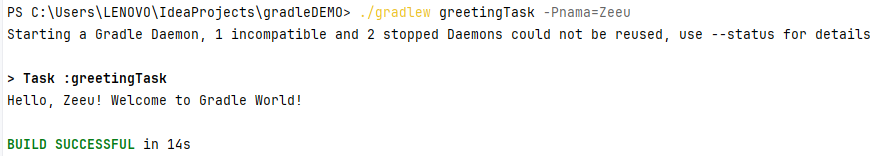

# Deskripsi Project

Berikut adalah sebuah proyek Gradle sederhana yang menerima parameter dari Command Line Interface (CLI) dan mencetaknya dengan pesan ucapan.

## Buat Project Gradle Baru
Jalankan dengan perintah berikut pada Terminal.

```bash
gradle init --type java-library
```

Ini akan membuat proyek Gradle baru dengan struktur direktori dan file ```build.gradle```di awal.

## Cara Running Project
Jalankan dengan perintah berikut pada Terminal. 

```bash
./gradlew greetingTask -Pnama=NamaKamu
```
Ganti ```NamaKamu``` dengan nama anda.

## Output Running Project
Berikut merupakan hasil running projectnya.

